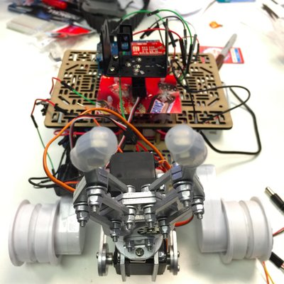

Node Rover
========================

## Node Rover




### Introduction

Wireless, remote control Mars Rover.....with a Claw!!. Rover is based on the Mars rover (4 motors with continuous tracks). The rover was built from scratch, and is controlled via a node.js backend. The goal was to have a mobile first web app which could control several aspects of the rover (motor movement, claw, camera pan tilt bracket) over wifi.


### Instructions

Clone the repository:

```
$ git clone git@github.com:snozza/project-noderover.git
```

Change into the directory and npm install the modules:

```
$ cd project-noderover
$ npm install
```

Run the tests: 

```
$ mocha
```

Start the node server and visit http://localhost:3000/ 

```
$ node server.js

```

### Special Hardware

Please note that the app is written for the Arduino Uno combined with a RN-XV Wifly Module, Wireless SD Shield, and a 4 motor controller shield. The code will likely need to be modified to accomodate other products.

### Additional Info

You will also need to sign up for a Twitter Dev account in order to use the Twitter control functionality. Add a file called config.js to the root of /node_modules/twit and add it to your .gitignore file. Then add the following (replaced with your details):

```
module.exports = {
  consumer_key: '...'
  , consumer_secret: '...'
  , access_token: '...'
  , access_token_secret: '...'
}

```
